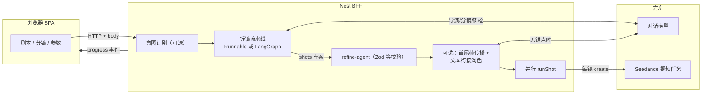

# 项目指南：重点、难点与高质量短视频工作流

本文说明 **本仓库在做什么**、**难在哪里**、**AI 与人工的分工**，以及 **推荐步骤**。  
**产品定位**：面向 **二维（2D）动漫风格** 的短视频生成与编排；**不做三维（3D）动漫或写实 CG 成片目标**。服务端提示策略会对介质做「动漫向」锁定（含二维/三渲二等表述），若你需要纯 3D 管线，应在独立项目或专用模型/workflow 中实现，不在当前仓库范围内。

**阅读线索**：第 **2～5** 节为架构与选型；**§5.5～5.6** 讨论 **AI 协作友好度与其它栈备选**；**§6** 为 **Agent 设计思路与框架边界**；其后为难点（含 **人工侧技术重难点**）、人机分工与工作流。

---

## 1. 项目是做什么的（重点）

| 层面            | 说明                                                                         |
| ------------- | -------------------------------------------------------------------------- |
| **前端**        | Vite SPA：剧本/分镜编辑、镜头参数、角色与模板、任务与时间线、成片预览与导出等。                               |
| **BFF（Nest）** | 统一 HTTP + WebSocket：对接方舟 Seedance（创建/查询视频任务）、可选 FFmpeg 拼接、用量账本、Agent/拆镜编排。 |
| **上游模型**      | 以 **Seedance 视频** 为主；对话模型用于剧本顾问、拆镜预览、衔接润色等文本环节（见 SPEC-003）。                |

数据流概览：`浏览器 → Nest（代理 /api、Socket）→ 方舟 API →（可选）本地 FFmpeg 拼接 → 静态导出`。详见根目录 [README.md](./README.md)。

---

## 2. 架构分层（谁负责什么）

| 层级           | 技术                                  | 职责                                                                     |
| ------------ | ----------------------------------- | ---------------------------------------------------------------------- |
| **展示与交互**    | React + Vite + Tailwind + shadcn/ui | 编辑器、分镜表、任务与时间线、用量视图；通过 HTTP/WebSocket 与 Nest 对话。                       |
| **编排与集成**    | NestJS                              | 校验与合并请求体、调用方舟对话/视频 API、进程内并行跑镜、Socket 推送里程碑、FFmpeg 拼接与静态导出等 **服务端能力**。 |
| **模型侧**      | 方舟对话模型 + Seedance 视频                | 文本阶段（拆镜、顾问、衔接润色等）与像素阶段（逐镜视频生成）分离，由 Nest 串联。                            |
| **遗留网关（可选）** | Next + `server.ts`                  | 历史路径：Python bridge、旧版网关；**默认栈不依赖**，新能力以 Nest SPEC 为准（见 README「拓扑」）。    |

---

## 3. 端到端流程：用户输入 → 模型 → 输出（为何用这种形态）

下面描述 `**POST /api/agent`（或等价 workflow）** 的主路径：先 **结构化文本管线**，再 **逐镜提交 Seedance**，进度通过 **Socket** 推送。这种「**多阶段编排 + 强校验 + 可观测**」的形态，比「单次大 prompt 直接调视频模型」更适合 **可控成本、可调试、可插拔策略**（例如衔接 pass、降级链）。

**采用这种形式的主要原因：**

1. **职责分离**：对话模型擅长「结构化规划与改写」，视频模型擅长「给定约束下的像素生成」；混在一起更难调参、也难单独降级或限流。
2. **可验证的中间结果**：`refine-agent` 等对 shots 做校验与归一化，避免非法字段直接进入 Seedance 造成浪费。
3. **可观测性**：`agent-plan`、`agent-langchain-*`、`agent-refined`、`pipeline-init` 等事件便于前端展示进度与排障。
4. **策略可开关**：流水线（`VOLC_AGENT_PIPELINE`）、LangGraph（`VOLC_AGENT_LANGGRAPH`）、镜间衔接（`VOLC_AGENT_PR_A_CONTINUITY` 等）可独立开关，便于渐进演进。

**补充：** 剧本顾问、拆镜「预览」等可走 **只读对话接口**，不提交视频任务——降低试错成本（见 SPEC-003）。

---

## 4. 前端选型：Tailwind、shadcn/ui、Vite

### 4.1 为何使用 Tailwind CSS

- **效用类（utility-first）**：在 JSX 里直接表达间距、排版、响应式与暗色变量，适合 **工具型面板** 快速迭代，减少大量手写 SCSS/BEM 命名。
- **与设计令牌一致**：与 shadcn 推荐的 **CSS 变量主题**（如 `components.json` 里 `cssVariables`）配合，换肤、对比度、圆角等在全局一层收敛。
- **构建侧按需生成**：JIT 只打包用到的类，对中大型 SPA 体积可控。

### 4.2 为何使用 shadcn/ui

- **源码归仓库所有**：组件通过 CLI **拷贝到 `src/components/ui`**，不是黑盒 `node_modules` UI 包；便于按产品定制交互与无障碍细节。
- **技术栈组合清晰**：Radix（行为与可达性）+ `class-variance-authority` + `tailwind-merge`，与 Tailwind 同一套样式哲学。
- **渐进迁移**：可按 [.cursor/ui-shadcn-migration-batches.md](./.cursor/ui-shadcn-migration-batches.md) 分批替换原生 `<button>` / `<select>`，风险可控。

### 4.3 为何主前端用 Vite 打包 SPA，而不是用 Next 做主应用

- **产品是重交互控制台**：核心是编辑器、WebSocket、长时间任务状态；**不以 SEO 或首屏 SSR 为第一优先级**，SPA + 静态部署足够。
- **边界清晰**：**API / WebSocket / 密钥与方舟签名均在 Nest**，前端只做展示与编排；若用 Next 同时扛 SSR + BFF，容易与 Nest **职责重叠**（README 明确默认栈不经 Next）。
- **开发体验**：Vite 的 ESM + HMR 对纯客户端项目在迭代速度上通常非常顺手；构建链成熟（`vite build` + 静态资源）。

### 4.4 「那 Next + Turbopack 可以吗？」

- **技术上可以**：Next 也能打包 React；开发环境可选用 Turbopack 等加速 bundling。
- **在本仓库语境下收益有限**：默认架构已经把 **BFF 固定在 Nest**；若仅为打包器引入 Next，会附带 **路由框架、SSR/运行时模型、部署形态** 等一整套假设，与当前「**Nest 网关 + Vite 静态前端**」分裂边界不符。
- **Turbopack 与 Vite 是不同赛道**：前者深度绑定 Next 生态；本项目前端已选 **Vite 统一工具链**（含 Vitest 等），避免双栈维护。若未来真要合一，应先讨论 **是否迁移 BFF** 或 **Monorepo 部署模型**，而不是单独「换个打包器」。

---

## 5. 后端与 Agent 选型：Nest、LangChain、LangGraph、Next

### 5.1 为何主 BFF 使用 NestJS

- **结构化服务端应用**：依赖注入、模块边界、配置（`ConfigModule`）适合接入 **多家方舟接口 + FFmpeg + 账本** 等横切能力。
- **WebSocket 一等公民**：`socket.io` 与 Gateway 模式与 **任务进度推送** 契合。
- **与前端解耦**：不绑定 React 运行时；团队可以独立演进 API 契约与 Agent 策略。

### 5.2 LangChain 在本项目中的作用

- **编排对话多步流水线**：`AnimeAgentPipelineService` 使用 `@langchain/core` 的 **Runnable**（及 Lambda）把 **导演 → 结构化分镜 → 质检** 等步骤串成可调用链，便于传入统一上下文（剧本、RAG、`knowledgeContext` 合并层等）。
- **与方舟对话模型对齐**：复用生态里的抽象习惯（链式组合、后续扩展节点），同时具体 HTTP 仍走仓库内 Volc 封装与降级链（SPEC-003）。

### 5.3 LangGraph 与 LangChain 的取舍

- **默认线性链**：未强制 LangGraph 时，拆镜仍走 **Runnable 顺序流水线**，简单、易推理。
- **可选 LangGraph**：当设置 `**VOLC_AGENT_LANGGRAPH`**（见 `anime-agent.pipeline.service.ts` 与 `.env.example`）时，拆镜可走 **StateGraph**：导演 → 分镜 → 质检 → **一致性审计**，未通过时可 **路由回补救回路再分镜**，适合要在服务端表达 **分支与循环** 时使用。
- **小结**：LangChain 偏 **DAG/线性 Runnable**；LangGraph 偏 **显式状态机与条件边**。二者共用同一套 Volc 调用与 shots 结构，由环境开关选择复杂度。

### 5.4 Next.js 在本仓库中的位置

- `**apps/anime-video-generate-agent-server`** 标记为 **Legacy**：Next + 自定义 `server.ts`、Python bridge 等历史集成路径。
- **默认新功能写在 Nest**（README「拓扑与数据流」），避免业务逻辑在 Next/Nest 之间重复分叉。

### 5.5 选型是否考虑过「对 AI（编码助手）友好」

这里的「AI」指 **人机协作写代码、改仓库** 时的体验，而不是生成视频的模型。

**相对友好的地方（刻意对齐的常见实践）**

| 方面                    | 说明                                               |
| --------------------- | ------------------------------------------------ |
| **TypeScript + 显式类型** | 接口与 Zod/`refine-agent` 一类校验让「契约」可读，助手更少猜字段含义。    |
| **Nest 模块化习惯**        | `*.module.ts`、`*.service.ts`、依赖注入边界清晰，便于定位「该改哪」。 |
| **SPEC / SDD**        | [docs/sdd/](./docs/sdd/) 把意图落在纸上，减少口头约定与实现漂移。    |
| **shadcn 组件在仓库内**     | `components/ui` 为源码而非黑盒包，diff 可读、可局部重写。          |
| **策略用环境变量收口**         | 流水线、LangGraph、衔接 pass 等可开关，助手改逻辑时常不必动全盘。         |

**不够友好或需注意的点**

| 方面                              | 说明                                                            |
| ------------------------------- | ------------------------------------------------------------- |
| **LangChain / LangGraph 版本与抽象** | 生态迭代快，助手生成的示例可能与当前 `@langchain/*` minor 不完全一致，需要人对照仓库现有写法。    |
| **跨进程与异步**                      | Socket 事件顺序、并行 `runShot`、方舟轮询等 **运行时问题** 仍依赖日志与经验，单靠静态类型覆盖不全。 |
| **「魔法」配置**                      | Nest、Vite 代理、多层 env 回退路径分散时，助手可能漏读某一层的 `.env.example`。        |

**结论**：选型 **部分** 考虑了「助手 + 人类」的可维护性（类型、模块、文档、组件源码归仓），但 **没有把「对 LLM 写代码最省事」当作第一目标**；第一目标仍是 **业务边界（Nest BFF）、集成复杂度可控、与方舟契约稳定**。友好度是衍生收益。

### 5.6 若希望更偏「另一套友好」或换栈，常见备选（取舍）

下列 **不是本仓库当前默认**，仅供对照「如果痛点变了可以怎么走」。

| 层级              | 备选方向                                           | 适合诉求                   | 代价 / 风险                                         |
| --------------- | ---------------------------------------------- | ---------------------- | ----------------------------------------------- |
| **BFF**         | **Fastify / Express / Hono** 薄网关               | 极小内核、拒绝 Nest 样板        | 自己要铺 DI、横切、WS、配置惯例；多人协作易各自为政。                   |
| **BFF（Python）** | **FastAPI**                                    | 团队全是 Python、要与 ML 脚本同栈 | 与现有 Nest/TS 前端契约分裂；需严格 OpenAPI 同步。              |
| **长事务 / 队列**    | **BullMQ / Temporal / Inngest**                | 镜任务要持久队列、重试、可视化编排      | 运维与模型复杂度上升；当前默认是进程内并行（README 路线图提及队列）。          |
| **Agent 编排**    | **手写状态机 + `fetch`**，或仅用 **结构化输出**（JSON schema） | 极度厌恶框架 churn、链路很短      | 失去 LangGraph 现成的条件边与Checkpoint生态；图复杂后要自研可视化与回放。 |
| **前端**          | **Remix / TanStack Router** 等                  | 要强约定路由与 loader，仍可不 SSR | 引入另一套路由与数据加载范式；需评估与现有 Zustand/Query 的叠床架屋。      |
| **文档站 / SSR**   | **Next 仅用于官网或文档**，控制台仍 Vite                    | 要 SEO、MDX              | 与 README 默认「控制台不经 Next」一致时可并存 **两个前端入口**。       |

---

## 6. Agent 设计思路与框架边界

本节描述 **编排层的设计哲学**（与具体 Endpoint ID 无关）：为何拆阶段、框架扮演什么角色、哪里必须坚持确定性。

### 6.1 核心思路：「确定性外壳 + 随机性内核」

- **内核**：对话模型与视频模型的输出 inherently **随机**，同一剧本多次运行会有差异。
- **外壳**：Nest 侧用 **固定步骤顺序**（或可 LangGraph **固定状态机拓扑**）、**Zod/业务校验**、**prompt-policy 合成规则**，把随机输出 **箍** 在可接受的结构与字段范围内。
- **好处**：线上排障时可以区分「模型胡写」还是「集成本身 bug」；成本上可减少「非法请求打到 Seedance」。

### 6.2 人机分工在架构上的体现

- **编辑器中的 shots** 被视为用户意图的载体；服务端流水线可在 `**VOLC_AGENT_PIPELINE` 开启时** 用 LLM **补全/改写** shots，但最终仍经过 `**refine-agent`** 才能进入下游。
- **失败兜底**：LangChain 管线异常时可 **降级** 到仅本地 refine 路径（见 `AgentService` 中 `agent-langchain-error` 分支），避免「一整条链路不可用就完全停摆」。

### 6.3 LangChain / LangGraph 在本仓库中的角色

- **LangChain**：优先解决 **Runnable 组合与复用**（多步对话共享上下文、统一注入 RAG / evolution snippet），而不是「必须用全家桶」。
- **LangGraph**：仅在需要 **显式分支与回路**（审计不通过 → 补救提示 → 再分镜）时加码；用 `**VOLC_AGENT_LANGGRAPH`** 与线性链 **二选一**，避免默认就把运维与心智复杂度拉满。

### 6.4 框架边界与非目标

| 边界                    | 含义                                                        |
| --------------------- | --------------------------------------------------------- |
| **Volc 适配留在 Service** | HTTP 详情、降级链、错误码映射集中在 `Volc`* 服务；Agent 编排层尽量不直接拼裸 `fetch`。 |
| **可观测事件稳定**           | Socket 事件名与载荷字段演进要克制，否则前端与外部脚本全部重修。                       |
| **非目标**               | 不在此仓库承诺「全自动导演取代人类」；不默认实现 **成片级计算机视觉质检**（可由后续专用评测服务扩展）。    |

### 6.5 扩展 Agent 时的推荐顺序

1. **改 prompt 块 / policy**（成本最低）：`prompt-policy`、`evolution-`*、`storyboard-`* 文本策略。
2. **加 Runnable 节点或 LangGraph 节点**（中等）：保持输入输出类型与 `PipelineShot` 一致。
3. **改执行模型**（最高）：例如全局改为串行跑镜、接入新视频厂商——走 ADR + SPEC，先锁契约再写代码（README「可扩展性」表）。

---

## 7. 难点在哪里（为什么「高质量」不容易）

| 难点                             | 原因                                                           | 当前工程内的应对思路                                                                                                                                                                                              |
| ------------------------------ | ------------------------------------------------------------ | ------------------------------------------------------------------------------------------------------------------------------------------------------------------------------------------------------- |
| **跨镜头视觉一致性**                   | 扩散/视频模型逐镜生成，角色衣着、脸型、场景容易漂移。                                  | 提示词分层（`consistencyNotes`、`knowledgeContext`、KB 片段）、角色库与参考图、人工抽检与返工；**没有**全自动「成片级视觉质检 Agent」（README 能力边界已写明）。                                                                                            |
| **镜与镜的时间与画面衔接**                | 默认多为 **并行跑镜**，上一段视频的「真实尾帧」未必自动成为下一段的首帧；仅靠文本或静态参考链路与成片观感仍有差距。 | 可选 **衔接 pass**（环境变量如 `VOLC_AGENT_PR_A_CONTINUITY` / `VOLC_AGENT_SHOT_CONTINUITY_PASS`）：**优先**用相邻镜头的 **首尾帧锚点**（`lastFrame` → `firstFrame`），缺锚点时再做 **全局一次性文本衔接润色**。若要「上一段渲染完再驱动下一段」，需改为串行或队列策略，属于产品/架构扩展。 |
| **剧本 → 分镜 → 可执行 prompt 的信息损失** | 文学性描写不等于可直接生成的镜头语言。                                          | LangChain 拆镜流水线（`VOLC_AGENT_PIPELINE`）、剧本顾问 API；仍需人工改镜序、时长、景别与否定项。                                                                                                                                      |
| **成本、限流与稳定性**                  | 云端配额、429/503、模型降级链。                                          | 对话与 Seedance 均有降级与环境变量配置；前端展示错误码与文档链接（SPEC-003）。                                                                                                                                                        |
| **成片观感 ≠ 单镜好看**                | 剪辑节奏、转场、音量（若未来加音轨）依赖后期。                                      | 时间线 JSON 导入导出、`POST /api/timeline/concat`（含可选淡入淡出）；复杂调色/配音通常在外部工具完成。                                                                                                                                    |

### 7.1 业务难点之外：若「生成」多交给模型，人工仍偏「技术」的重难点

创意与审美无法自动化，但下列事项往往 **落在工程师 / 技术型监制** 身上（与 §8 互补）：

| 技术向难点                  | 为何仍重                                                                                                                        |
| ---------------------- | --------------------------------------------------------------------------------------------------------------------------- |
| **提示词策略与 policy 生命周期** | `prompt-policy`、导演/分镜 system 文案、`composeSeedancePrompt` 任一改动手都可能 **全局偏画风或偏叙事**；需要小流量对比与版本记录（仓库外可用试验表或 git blame + SPEC 修订）。 |
| **契约与兼容性**             | 前端 shots、Nest `refine-agent`、方舟字段与 Seedance 约束 **任一不一致** 即表现为「静默失败」或浪费额度；Schema 演进要与前端发布节奏对齐。                               |
| **分布式与异步语义**           | 并行 `runShot`、Socket 顺序、任务重入、方舟轮询超时——**竞态与幂等** 问题不会单靠模型解决，要靠代码与日志契约。                                                         |
| **观测与排障**              | `ark_code` / `volc_code_n`、降级链是否触发、LangChain 失败 fallbacks——线上问题需要 **懂栈的人** 读事件链，而不是仅看视频好坏。                                  |
| **成本与配额策略**            | `storyboardMaxShots`、模型降级、是否默认开 LangGraph / 衔接 pass，直接关系账单；属于 **工程折衷**，不是单次 prompt 能定终身。                                    |
| **集成扩展**               | 新视频厂商、串行跑镜、抽帧服务、外部评测——都要 **架构决策**（ADR）与维持 SPEC，超出「让 AI 写一段脚本」的范畴。                                                           |

---

## 8. AI 做了什么 vs 需要人工做什么

### AI（自动化/辅助）适合做的事

- 根据剧本产出 **分镜草案**（ shots：画面描述、顺序等），减轻从零拆镜的工作量。
- **剧本顾问式反馈**（结构、缺画面信息、格式提示等），偏动漫成片语境。
- **Prompt 合成与平台侧动漫介质约束**（`prompt-policy` / `composeSeedancePrompt`），减少漏写风格约束的情况。
- **可选衔接 pass**：相邻首尾帧传播 + 无锚点时的文本衔接润色（见 **§7** 表中「镜与镜衔接」一行）。
- **任务编排与进度**：创建 Seedance 任务、Socket 推送状态、用量聚合等。

### 建议人工必须把关的事

- **创意与叙事**：主题、节奏、梗与台词——模型只能辅助，不能代替定调。
- **角色与世界观一致性**：设定表、参考图、每镜是否违背设定——需 **人工选镜、删改、重跑**。
- **镜头参数与参考图**：分辨率、时长、首帧/尾帧 URL、否定 prompt；参数错误会直接反映在成片里。
- **质检与迭代**：抽查每一镜是否可用；不行的镜头单独重生成，而不是假设一次出片。
- **对外合规与版权**：素材与商用边界由团队流程保证，工具链不替代法务审查。

### 与上文人机分工小节的关系

- **偏创作 / 监制**：以本节「AI 适合 / 人工把关」列表为主。  
- **偏工程 / 平台**：见 **§7.1**，二者合力才能把「模型能跑」升级为「团队能长期接单」。

---

## 9. 推荐步骤：怎样做出相对高质量的 2D 动漫短视频

以下为 **实践顺序**，可按项目体量删减。

1. **写清剧本骨架**
  场次、角色、关键动作与对话写清楚；避免只有情绪没有可视信息。
2. **跑剧本顾问（可选）**
  根据 API 返回补齐「画面上必须交代什么」，减少拆镜返工。
3. **生成或编辑分镜**
  开启流水线时由 Agent 拆镜；人工调整镜序、每镜时长意图、景别，并为重要镜头写清 **主体 + 背景 + 光影 + 风格关键词**。
4. **配置一致性素材**
  角色库、模板、`consistencyNotes`、`knowledgeContext`、环境变量中的 KB 片段——与 SPEC/README 一致使用。
5. **为首尾帧与参考图留预算**
  关键转场镜尽量提供 **firstFrame / lastFrame** 或参考图；需要连贯时再打开 **衔接 pass** 环境变量。
6. **分镜级生成与抽检**
  先确保 **多数镜头单独合格**，再考虑整条时间线拼接。
7. **时间线拼接与微调**
  用时间线导出/拼接 API；转场简单时可用内置 fade；复杂剪辑导出后到专业剪辑软件。
8. **成片再审**
  连贯性、闪烁、文字安全区；不满意镜头回到步骤 6 定点重跑。

---

## 10. 与官方文档的关系

- **架构与接口**：以 [README.md](./README.md)、[docs/sdd/](./docs/sdd/) 下 SPEC 为准。  
- **模型与 Agent**：SPEC-003（方舟 Endpoint、LangChain、`prompt-policy`）。  
- **时间线与导出**：SPEC-004（见 README 索引）。

若实现与 SPEC 冲突，应优先修订 SPEC 或代码使二者一致。

---

## 11. 小结

| 问题           | 结论                                                                                                                   |
| ------------ | -------------------------------------------------------------------------------------------------------------------- |
| 项目重点         | 2D 动漫向短视频：**剧本 → 分镜 → Seedance 生成 →（可选）拼接与导出**，Nest 统一网关。                                                            |
| 前端选型         | **Tailwind** 做设计令牌与效用类；**shadcn/ui** 提供可复制、可改的 Radix 组件；**Vite** 承载 SPA 与快速 HMR，与 Nest BFF 边界清晰。                     |
| 后端选型         | **Nest** 负责 HTTP/WS、方舟集成与任务编排；**LangChain Runnable** 为默认拆镜链；可选 **LangGraph** 表达审计失败后的回路；**Next** 包保留为 **Legacy 网关**。 |
| Agent 形态     | **多阶段编排 + 校验 + Socket 可观测**；文本模型规划与视频模型生成分离，便于降级、限流与策略开关（详见 **§6**）。                                                 |
| AI 协作友好度     | **部分考虑**：TS、模块化、SPEC、shadcn 源码归仓有利助手协作；LangChain 迭代与异步集成仍需人工把关（详见 **§5.5～5.6**）。                                     |
| 最大难点         | **一致性**与**镜间衔接**（尤其并行生成时）；高质量依赖 **提示词 + 参考 + 人工迭代**。                                                                 |
| 自动化（模型 + 编排） | 拆镜、顾问、prompt 封装、可选衔接润色、任务与进度——不替代导演与质检。                                                                              |
| 人工（创作向）      | 叙事定调、分镜决策、参考与参数、抽检重跑、后期剪辑决策（**§8**）。                                                                                 |
| 人工（技术向）      | Policy/契约演进、异步与观测排障、成本与配额、集成扩展（**§7.1**）。                                                                            |
| 3D           | **不在本产品范围内**；仓库策略锁定为动漫介质表述，目标成片为 **2D 动漫 workflow**。                                                                 |

